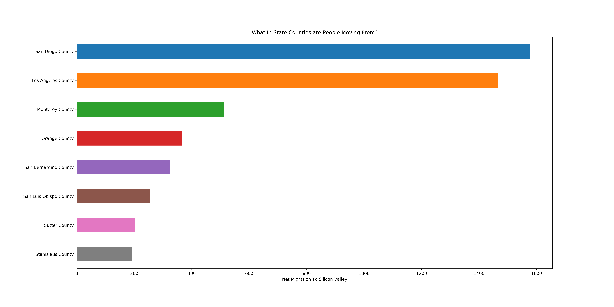
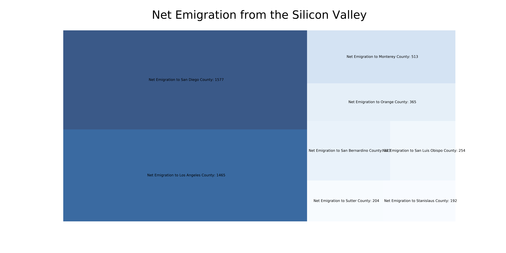
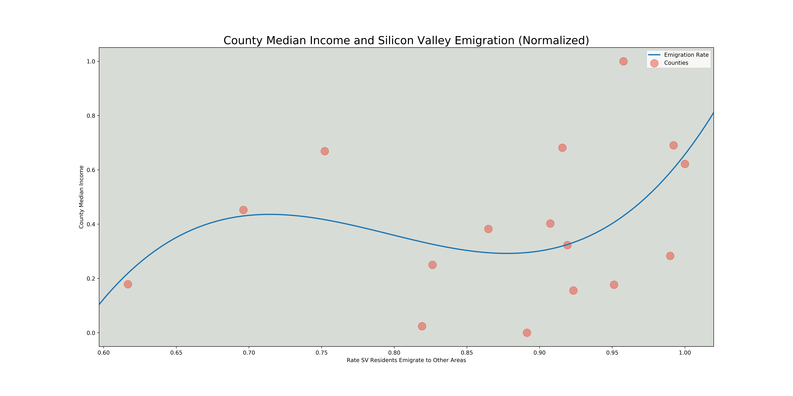

# Analysis of per capita income and net immigration rate in Silicon Valley in the state of California 

*Counties with largest number of people moving to Silicon Valley*

*Counties with largest number of people emigrating from Silicon Valley*

*Correlation between lower county median incomes and higher rate of emigration from Silicon Valley*
